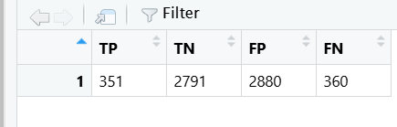
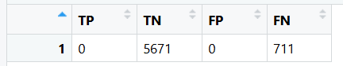
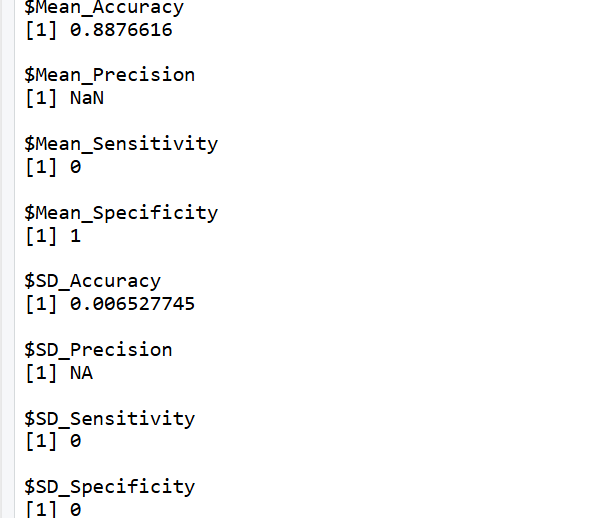

# Análisis de Clasificadores

## Matriz de Confusión del Clasificador Aleatorio
A continuación se muestra la matriz de confusión generada para el clasificador aleatorio.

## Matriz de Confusión del Clasificador Mayoritario y Métricas
A continuación se presenta la matriz de confusión del clasificador mayoritario y las métricas correspondientes.

### Métricas del Clasificador Mayoritario

