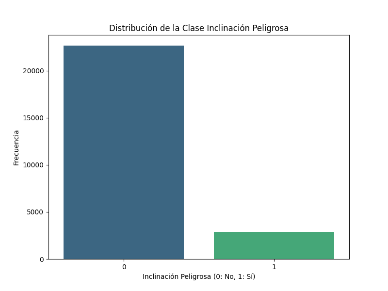
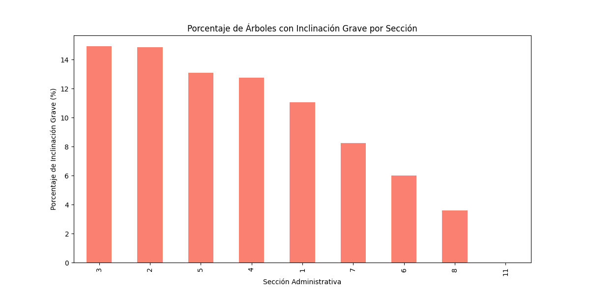
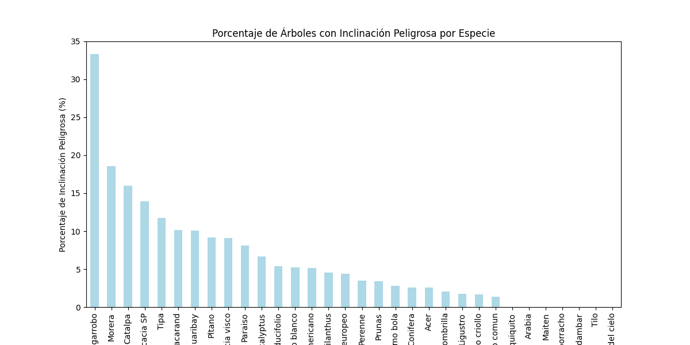
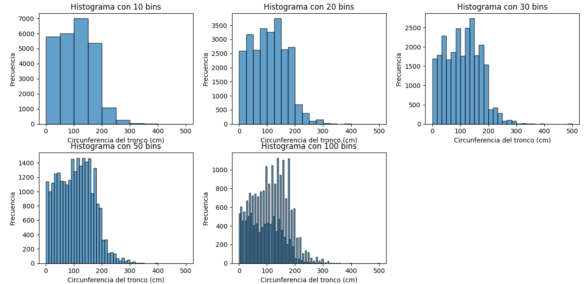
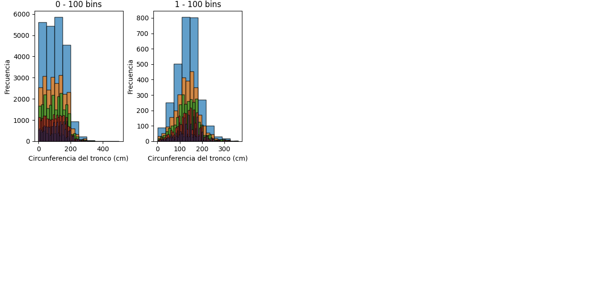

## 1. Distribución de la Clase `inclinacion_peligrosa`

La distribución de la clase `inclinacion_peligrosa` muestra cuántos árboles tienen una inclinación que se considera peligrosa. A continuación, se muestra un gráfico que representa la cantidad de árboles inclinados de forma peligrosa frente a los que no tienen dicha inclinación.

---

## 2. ¿Se Puede Considerar Alguna Sección Más Peligrosa que Otra?

Al observar los árboles inclinados peligrosamente en cada sección, podemos identificar si alguna sección específica tiene una mayor cantidad de árboles peligrosos y, por lo tanto, puede considerarse más riesgosa.

---

## 3. ¿Se Puede Considerar Alguna Especie Más Peligrosa que Otra?

Este gráfico muestra la cantidad de árboles peligrosos clasificados por especie, lo que permite identificar si alguna especie particular tiende a ser más peligrosa. Esto puede ayudar a determinar si es necesario tomar precauciones adicionales con ciertas especies.

# Informe de Análisis de Circunferencia de Tronco

## Histograma de circ_tronco_cm

A continuación se presenta el histograma de la variable `circ_tronco_cm`:

## Histograma de circ_tronco_cm por Inclinación Peligrosa

A continuación se muestra la distribución de la variable `circ_tronco_cm` separada por la clase `inclinacion_peligrosa`:

## Criterios de Corte para `circ_tronco_cm_cat`

Los criterios de corte utilizados para la nueva categoría `circ_tronco_cm_cat` son los siguientes:

- Bajo: 0 - 30
- Medio: 30 - 60
- Alto: 60 - 100
- Muy alto: >100

