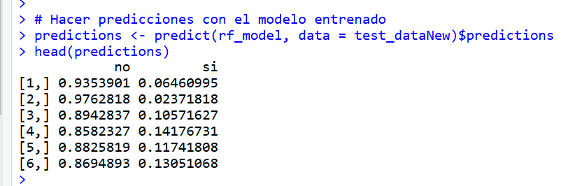
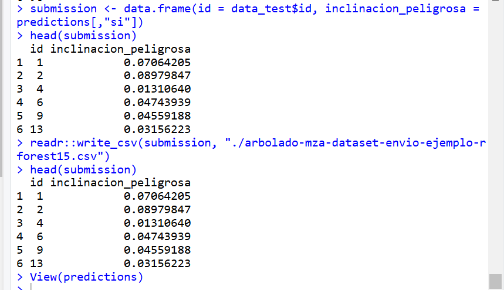

# Parte B

# Documentación del Proyecto

## Descripción del Proceso de Preprocesamiento

### Eliminación de Variables
Durante el preprocesamiento de los datos, eliminamos las siguientes columnas del conjunto de entrenamiento (`train_data`):
- `ultima_modificacion`: Esta columna no aporta información relevante para el modelo, por lo que fue eliminada.
- `id`: Esta columna solo contiene un identificador único que no influye en la predicción de la variable objetivo.

### Creación de Nuevas Variables
Se creó una nueva variable categórica para la columna `inclinacion_peligrosa`, que inicialmente era una variable numérica. Esta variable fue convertida en una variable de tipo factor con valores:
- `"si"` si el valor original era `1`
- `"no"` si el valor original era cualquier otro valor diferente de `1`

### Transformación de Variables
No se aplicó normalización ni estandarización en los datos numéricos, ya que el algoritmo de Random Forest que se utiliza no requiere que las variables numéricas estén en una escala específica.

## Resultados Obtenidos en el Conjunto de Validación
El modelo fue entrenado usando un 35% de los datos como conjunto de validación (`test_dataNew`). La precisión calculada en este conjunto de validación fue la siguiente:
- **Precisión en conjunto de validación:** La precisión del modelo se calcula mediante el promedio de las predicciones correctas en relación con los valores reales de `inclinacion_peligrosa`.

## Resultados Obtenidos en Kaggle
El conjunto de pruebas (`data_test`) fue cargado y utilizado para generar un archivo de predicciones para su evaluación en Kaggle. Los resultados específicos obtenidos en Kaggle se presentan en la siguiente tabla:
- **Resultados en Kaggle:** 0.74685

## Descripción Detallada del Algoritmo Propuesto

Para este proyecto se usó el algoritmo de **Random Forest** implementado mediante el paquete `ranger`. La configuración del modelo se describe a continuación:

- **Algoritmo:** `Random Forest`
- **Número de árboles (`num.trees`):** 600
- **Número de variables a considerar en cada división (`mtry`):** 3
- **Importancia local:** Se habilitó la importancia local (`local.importance = TRUE`), lo que permite entender la relevancia de cada variable en cada predicción.
- **Probabilidad:** Se activó la predicción probabilística (`probability = TRUE`) para obtener las probabilidades de clasificación.

La fórmula de entrenamiento utilizada fue:
```r
inclinacion_peligrosa ~ circ_tronco_cm + lat + long + altura + especie + seccion + diametro_tronco + area_seccion
```

## se probo el modelo sobre data_test y estos fueron los resultados: 


## Solo se tomó el valor de si, que indica la pertenencia a Inclinación Peligrosa, teniendo como resultado algo así:


